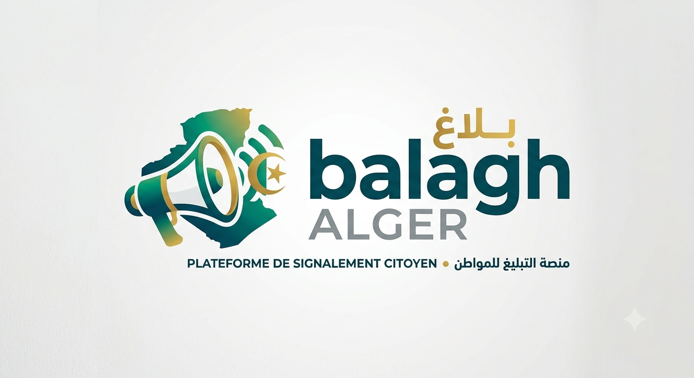

# Balagh Alger —بلاغ الجزائر

**Plateforme de signalement citoyen pour les municipalités d'Alger**




---

## Table des matières

1. [Présentation](#1-présentation)
2. [Fonctionnalités](#2-fonctionnalités)
3. [Architecture technique](#3-architecture-technique)
4. [Stack technologique](#4-stack-technologique)
5. [Installation](#5-installation)
6. [Configuration](#6-configuration)
7. [Base de données](#7-base-de-données)
8. [Système RBAC](#8-système-rbac)
9. [Workflow de signalement](#9-workflow-de-signalement)
10. [Système de file d'attente (Queue)](#10-système-de-file-dattente-queue)
11. [API REST](#11-api-rest)
12. [PWA & Mode hors-ligne](#12-pwa--mode-hors-ligne)
13. [Internationalisation (i18n)](#13-internationalisation-i18n)
14. [Système de gamification](#14-système-de-gamification)
15. [Système SLA](#15-système-sla)
16. [CMS Landing Page](#16-cms-landing-page)
17. [Sécurité](#17-sécurité)
18. [Structure du projet](#18-structure-du-projet)
19. [Routing & API](#19-routing--api)
20. [Contrôleurs](#20-contrôleurs)
21. [Helpers & Bibliothèques](#21-helpers--bibliothèques)
22. [Design System](#22-design-system)
23. [Déploiement](#23-déploiement)
24. [CLI Artisan](#24-cli-artisan)
25. [Statistiques](#25-statistiques)
26. [Backup & Monitoring](#26-backup--monitoring)

---

## 1. Présentation

**Balagh Alger** (بلاغ الجزائر — « Signalement d'Alger ») est une plateforme web de signalement citoyen destinée aux municipalités de la Wilaya d'Alger. Elle permet aux citoyens de signaler des problèmes d'infrastructure urbaine (nids-de-poule, fuites d'eau, pannes d'éclairage, déchets sauvages, etc.) et de suivre leur traitement via un workflow administratif multi-étapes jusqu'à la résolution.

### Caractéristiques principales

- **Pas de framework** : MVC custom en PHP 8.x avec autoloading manuel
- **Bilingue** : Français / Arabe avec support RTL complet
- **PWA** : Progressive Web App avec mode hors-ligne et notifications push
- **RBAC** : 7 niveaux de rôles avec contrôle d'accès basé sur la portée
- **Gamification** : Points, badges, classement pour encourager la participation
- **CMS** : Page d'accueil entièrement gérable par l'administration
- **Queue** : Système de jobs asynchrones Redis
- **SLA** : Suivi des délais avec alertes automatiques
- **Assistant IA** : Chatbot intelligent avec intégration Gemini API, contexte base de données
- **~680 fichiers PHP** | **~26 000 lignes de code** | **38 tables MySQL**

---

## 2. Fonctionnalités

### Côté Citoyen
- Inscription et authentification
- Signalement rapide avec photos (7 étapes : Photos → Catégorie → Sous-catégorie → Daïra → Commune → GPS → Description)
- Suivi public par code de suivi (`BA-YYYY-NNNNNN`)
- Carte interactive avec marqueurs colorés par priorité
- Recherche de signalements à proximité (GPS)
- Détection de doublons automatique
- Communauté : publications, likes, commentaires
- Badges et classement (gamification)
- Avant/Après (suivi des interventions)
- Profil avec statistiques personnelles
- Mode hors-ligne avec file d'attente de signalements
- Notifications push
- Assistant IA intelligent (Gemini API, contexte base de données temps réel)

### Côté Administration
- Dashboard avec graphiques (catégories, priorités, daïras, tendances)
- Carte de chaleur d'activité (heures/jours)
- Comparaison périodique (mois précédent)
- Export CSV multi-sections
- Gestion des signalements (liste, détail, édition, assignation, clôture)
- Workflow d'intervention multi-étapes avec validation hiérarchique
- Gestion des utilisateurs, organisations, catégories, daïras
- Affectation des communes aux chefs de section
- Journal d'audit complet
- Système de notifications in-app
- Génération de rapports PDF
- Paramètres système
- Gestion des rôles et permissions (36 permissions, 7 rôles, interface onglets)

### Page d'accueil publique
- Statistiques en temps réel (AJAX)
- Présentation du service (Comment ça marche)
- Types d'anomalies (70 catégories)
- Galerie Avant/Après
- Témoignages
- FAQ
- Partenaires
- CMS administrable

---

## 3. Architecture technique

### Pattern MVC classique

```
Requête HTTP → public/index.php (Front Controller)
    → .env (putenv)
    → Session::init()
    → Router::dispatch()
        → Controller::action()
            → Helpers (Database, RBAC, CSRF...)
            → View rendering (PHP templates)
            → Layout (main.php ou citizen.php)
        → Response HTML / JSON / Redirect
```

### Système d'autoloading

```php
// public/index.php
spl_autoload_register(function ($class) {
    // App\Controllers\Foo → app/Controllers/Foo.php
    // App\Helpers\Foo → app/Helpers/Foo.php
    $path = APP_PATH . '/' . str_replace('\\', '/', $relative) . '.php';
    if (file_exists($path)) require_once $path;
});
```

Les helpers sont chargés explicitement via `require_once` (pas d'autoloading Composer pour le code applicatif).

### Deux systèmes de layout

| Layout | Fichier | Public cible | Design |
|--------|---------|-------------|--------|
| **Admin** | `layouts/main.php` | Personnel administratif | Sidebar sombre + top navbar |
| **Citoyen** | `layouts/citizen.php` | Citoyens | Navigation bottom mobile-first, glassmorphisme |

### Base Controller

Tous les contrôleurs étendent `App\Controllers\Controller` qui fournit :

```php
$this->view($name, $data);        // Rendu avec layout
$this->viewRaw($name, $data);     // Rendu sans layout
$this->json($data, $code);        // Réponse JSON
$this->redirect($url);            // Redirection
$this->withSuccess($msg);         // Message flash succès
$this->withError($msg);           // Message flash erreur
$this->auth();                    // Vérifie l'authentification
$this->requirePermission($perm);  // Vérifie une permission
$this->requireRole($role);        // Vérifie un rôle
$this->requireStaff();            // Vérifie que c'est du personnel
$this->checkCsrf($redirect);     // Vérifie le token CSRF
$this->audit($action, ...);       // Log d'audit
$this->getUser();                 // Récupère l'utilisateur courant
```

---

## 4. Stack technologique

### Backend

| Composant | Technologie | Version |
|-----------|------------|---------|
| Langage | PHP | 8.x |
| Base de données | MySQL | 8 |
| Cache / Queue | Redis (phpredis) | 7+ |
| PDF | DomPDF | ^3.1 |
| Session | PHP native | — |
| Routeur | Custom (`Router.php`) | — |

### Frontend

| Composant | Technologie | Source |
|-----------|------------|--------|
| CSS Framework | Bootstrap | 5.3 (CDN) |
| Design System | `app.css` / `citizen.css` | Custom (~5 300 lignes) |
| Assistant IA | Gemini API | — |
| Icônes | Font Awesome | 6.5.1 (CDN) |
| Icônes MDI | Material Design Icons | 7.4.47 (CDN) |
| Cartes | Leaflet.js | 1.9.4 (CDN) |
| Graphiques | Chart.js | (CDN) |
| Tables | DataTables | 1.13.7 (CDN) |
| Dialogues | SweetAlert2 | 11 (CDN) |
| Fonts | Inter + Noto Sans Arabic + Cairo | Google Fonts |
| JS | Vanilla JavaScript | — |
| JS (DataTables) | jQuery | (CDN) |

### Outils CLI

| Commande | Usage |
|----------|-------|
| `php artisan queue:work` | Démarrer le worker queue |
| `php artisan queue:status` | Taille des files |
| `php artisan queue:failed` | Jobs échoués |
| `php artisan queue:retry <idx>` | Relancer un job |
| `php artisan queue:flush` | Vider les jobs échoués |
| `php artisan sla:run` | Exécuter les alertes SLA |
| `php artisan app:info` | Info application |
| `php vendor/bin/phpunit` | Lancer les tests |
| `php vendor/bin/phpunit --filter=xxx` | Filtrer les tests |

### Tests

| Métrique | Valeur |
|----------|--------|
| Framework | PHPUnit 11 |
| Tests | 181 tests, 338 assertions |
| Couverture | Unitaires + Intégration (MySQL) + Fonctionnels (HTTP) |
| Base de test | `balagh_alger_test` (auto-créée, rollback automatique) |

```bash
# Lancer tous les tests
php vendor/bin/phpunit

# Tests unitaires uniquement
php vendor/bin/phpunit tests/Helpers/

# Tests d'intégration DB
php vendor/bin/phpunit tests/Helpers/RbacIntegrationTest.php

# Tests fonctionnels (serveur PHP requis sur le port 8000)
php -S 0.0.0.0:8000 -t public &
php vendor/bin/phpunit tests/Controllers/

---

## 5. Installation

### Prérequis

```bash
PHP >= 8.0 avec extensions :
  - pdo_mysql
  - redis (phpredis)
  - mbstring
  - json
  - fileinfo
  - finfo

MySQL >= 8.0
Redis >= 6.0
Apache2 avec modules :
  - mod_rewrite
  - mod_deflate
  - mod_expires
  - mod_headers
```

### Étapes d'installation

```bash
# 1. Cloner le projet
cd /var/www
git clone <repository> balagh-alger
cd balagh-alger

# 2. Installer les dépendances PHP
composer install

# 3. Configurer l'environnement
cp .env.example .env
nano .env  # Modifier les identifiants DB

# 4. Créer la base de données
mysql -u root -p
CREATE DATABASE balagh_alger CHARACTER SET utf8mb4 COLLATE utf8mb4_unicode_ci;
CREATE USER 'balagh_user'@'localhost' IDENTIFIED BY 'votre_mot_de_passe';
GRANT ALL PRIVILEGES ON balagh_alger.* TO 'balagh_user'@'localhost';
FLUSH PRIVILEGES;

# 5. Importer le schéma
mysql -u root -p balagh_alger < sql/001_create_tables.sql
mysql -u root -p balagh_alger < sql/001_reference_data.sql
mysql -u root -p balagh_alger < sql/002_landing_page_tables.sql
mysql -u root -p balagh_alger < sql/003_commune_sections.sql
mysql -u root -p balagh_alger < sql/004_community_feed.sql
mysql -u root -p balagh_alger < sql/005_gamification.sql
mysql -u root -p balagh_alger < sql/006_categories_full.sql
mysql -u root -p balagh_alger < sql/007_landing_page_tables.sql
mysql -u root -p balagh_alger < sql/008_category_restructure.sql
mysql -u root -p balagh_alger < sql/009_badges_sla.sql
mysql -u root -p balagh_alger < sql/010_community_feed.sql

# 6. Configurer Apache
sudo nano /etc/apache2/sites-available/balagh-alger.conf
# DocumentRoot /var/www/balagh-alger/public
# <Directory /var/www/balagh-alger/public> AllowOverride All </Directory>
sudo a2ensite balagh-alger.conf
sudo systemctl restart apache2

# 7. Démarrer Redis
sudo systemctl start redis-server

# 8. Démarrer le worker queue (optionnel)
php artisan queue:work --queue=high,default,push,low &

# 9. Configurer le cron SLA (optionnel)
crontab -e
# 0 * * * * cd /var/www/balagh-alger && php artisan sla:run
```

### Fichiers d'upload

```bash
mkdir -p public/uploads/{reports,avatars,interventions}
chmod -R 775 public/uploads
chown -R www-data:www-data public/uploads
```

---

## 6. Configuration

### Fichier `.env`

```env
DB_HOST=localhost
DB_NAME=balagh_alger
DB_USER=balagh_user
DB_PASS=BalaghPass2026!
APP_KEY=balagh-alger-secret-key-2026
APP_URL=http://balagh-alger.local
```

### Fichiers de config

| Fichier | Description |
|---------|------------|
| `app/Config/app.php` | Nom (FR/AR), URL, version, timezone (`Africa/Algiers`), locale (`fr`), debug |
| `app/Config/database.php` | PDO MySQL, `ATTR_EMULATE_PREPARES => false` |
| `app/Config/paths.php` | Constantes `ROOT_PATH`, `APP_PATH`, `VIEW_PATH` |
| `app/Config/redis.php` | Connexion Redis pour la queue |

### Configuration Apache

```apache
# public/.htaccess — Redirection vers index.php
RewriteEngine On
RewriteCond %{REQUEST_FILENAME} !-f
RewriteCond %{REQUEST_FILENAME} !-d
RewriteRule ^ index.php [L]

# Compression gzip
AddOutputFilterByType DEFLATE text/html text/css application/javascript

# Cache statique (1 mois)
Header set Cache-Control "public, max-age=2592000, immutable"

# Sécurité
Header set X-Content-Type-Options "nosniff"
Header set X-Frame-Options "SAMEORIGIN"
Header set Referrer-Policy "strict-origin-when-cross-origin"
```

### Base de données

**Important** : `PDO::ATTR_EMULATE_PREPARES => false` — les paramètres `LIMIT` et `OFFSET` doivent être interpolés, jamais bindés (bug PDO MySQL avec les entiers).

---

## 7. Base de données

### Schéma

**38 tables** réparties en 4 catégories :

#### Tables core

| Table | Description |
|-------|------------|
| `roles` | 7 rôles (citizen, intervenant, chef_section, chef_unite, admin_local, resp_central, admin_central) |
| `permissions` | 27+ permissions (dashboard.view, reports.create, reports.view, etc.) |
| `role_permissions` | Association rôles → permissions |
| `users` | Utilisateurs (email, mdp bcrypt, avatar, statut, org, daïra) |
| `user_roles` | Association utilisateurs → rôles |
| `organizations` | 20 organisations (SEAAL, Sonelgaz, DTP, SDE, etc.) |
| `dairas` | 13 daïras d'Alger avec coordonnées GPS |
| `communes` | 57 communes liées aux daïras avec coordonnées GPS |
| `section_communes` | Affectation chef_section → communes |
| `categories` | 70 catégories d'anomalies avec icônes, couleurs, délais |
| `subcategories` | 159 sous-catégories |

#### Tables signalements

| Table | Description |
|-------|------------|
| `reports` | Signalements (code suivi, titre, statut, priorité, GPS, workflow_step, deadline) |
| `report_history` | Historique des actions sur les signalements |
| `report_images` | Photos des signalements (primaire, type MIME, taille) |
| `report_interventions` | Interventions (agent, statut, GPS, dates début/fin) |
| `intervention_photos` | Photos d'intervention (pendant/après, légende) |
| `report_comments` | Commentaires sur les signalements |
| `report_ratings` | Notes et commentaires après résolution |

#### Tables communautaires

| Table | Description |
|-------|------------|
| `community_posts` | Publications du feed citoyen |
| `community_photos` | Photos des publications |
| `community_likes` | Likes sur les publications |
| `community_comments` | Commentaires sur les publications |
| `citizen_points` | Points de gamification |
| `user_badges` | Badges gagnés par les utilisateurs |

#### Tables système

| Table | Description |
|-------|------------|
| `notifications` | Notifications in-app (type, titre, message, data JSON, lu) |
| `audit_logs` | Journal d'audit (action, modèle, anciennes/nouvelles valeurs, IP, user agent) |
| `settings` | Paramètres système (groupe, clé, valeur, public) |
| `organization_rules` | Règles d'auto-assignation catégorie → organisation |
| `sessions` | Sessions PHP |
| `password_resets` | Tokens de réinitialisation de mot de passe |
| `push_subscriptions` | Abonnements notifications push Web |
| `sla_alertes` | Alertes SLA (J-2, J-1, retard) |

#### Tables CMS landing

| Table | Description |
|-------|------------|
| `landing_partners` | Partenaires |
| `landing_gallery` | Galerie photos |
| `landing_testimonials` | Témoignages (bilingue FR/AR) |
| `landing_before_after` | Avant/Après (photos upload) |
| `landing_faq` | Questions fréquentes (bilingue FR/AR) |
| `landing_settings` | Paramètres landing (réseaux sociaux, image hero) |

### Données de référence

- **20 organisations** : NETCOM, ASROUT, HUPE, ERMA, EMCU, EGCTU, SEAAL, SONELGAZ, APC, DTP, DRE, DEPTIC, GESTIMMO, OPGI, EDEVAL, Direction de la pêche, District administratif, EGPFC, OPLA, WILAYA
- **13 daïras** d'Alger
- **57 communes** avec coordonnées GPS
- **70 catégories** d'anomalies avec **159 sous-catégories**

---

## 8. Système RBAC

### Hiérarchie des rôles

```
admin_central (niveau 7)          ← Accès total, toutes les organisations
    ↑
resp_central (niveau 6)           ← Tous les signalements de son org
admin_local (niveau 6)            ← Tous les signalements de son org
    ↑
chef_unite (niveau 5)             ← Signalements de sa daïra + org
    ↑
chef_section (niveau 4)           ← Signalements de ses communes affectées
    ↑
intervenant (niveau 3)            ← Signalements qui lui sont assignés
    ↑
citizen (niveau 1)                ← Propres signalements uniquement
```

### Permissions (36)

| Permission | Module | Description |
|-----------|--------|------------|
| `dashboard.view` | dashboard | Accès au tableau de bord |
| `dashboard.stats` | dashboard | Voir les statistiques |
| `reports.view` | reports | Voir les signalements |
| `reports.view_all` | reports | Voir tous les signalements |
| `reports.view_assigned` | reports | Voir les signalements assignés |
| `reports.view_org` | reports | Voir les signalements de l'organisme |
| `reports.create` | reports | Créer un signalement |
| `reports.update` | reports | Modifier un signalement |
| `reports.delete` | reports | Supprimer un signalement |
| `reports.assign` | reports | Assigner un signalement |
| `reports.resolve` | reports | Résoudre un signalement |
| `reports.comment` | reports | Commenter un signalement |
| `reports.export` | reports | Exporter les signalements |
| `reports.reassign` | reports | Réaffecter un signalement |
| `reports.redirect` | reports | Rediriger vers un autre organisme |
| `users.view` | users | Voir les utilisateurs |
| `users.create` | users | Créer des utilisateurs |
| `users.update` | users | Modifier les utilisateurs |
| `users.delete` | users | Supprimer des utilisateurs |
| `users.suspend` | users | Suspendre des utilisateurs |
| `users.manage_org` | users | Gérer les utilisateurs de l'organisme |
| `organizations.view` | organizations | Voir les organismes |
| `organizations.create` | organizations | Créer un organisme |
| `organizations.update` | organizations | Modifier un organisme |
| `organizations.delete` | organizations | Supprimer un organisme |
| `categories.view` | categories | Voir les catégories |
| `categories.manage` | categories | Gérer les catégories |
| `dairas.view` | dairas | Voir les daïras |
| `dairas.manage` | dairas | Gérer les daïras |
| `notifications.view` | notifications | Voir les notifications |
| `notifications.manage` | notifications | Gérer les notifications |
| `settings.view` | settings | Voir les paramètres |
| `settings.update` | settings | Modifier les paramètres |
| `audit.view` | audit | Voir le journal d'audit |
| `landing.manage` | landing | Gérer la page d'accueil |

~ Gestion des rôles accessible via `/settings/roles` (nécessite `settings.update`). Interface avec onglets par rôle, toggles par module, filtre par mot-clé, compteurs.

### Résolution de portée

```php
// Rbac::scopeReports() génère une clause SQL WHERE
// basée sur le rôle et les affectations de l'utilisateur

// Exemple pour un chef_section :
// WHERE r.commune_id IN (SELECT commune_id FROM section_communes WHERE user_id = ?)

// Exemple pour un intervenant :
// WHERE r.assigned_to = ? OR r.citizen_id = ?
```

### Interface de gestion

Un panneau de gestion des rôles est disponible sur `/settings/roles` (accessible avec `settings.update`) :

- **7 rôles** organisés en onglets (pills)
- **36 permissions** regroupées par module (dashboard, reports, users, organizations, categories, dairas, notifications, settings, audit, landing)
- Toggles switch par permission, select/deselect par module ou global
- Filtre par mot-clé
- Admin Central en lecture seule (bypass code)
- Compteurs dynamiques (par rôle et par module)

### Utilisation dans les contrôleurs

```php
public function index()
{
    $this->auth();
    $this->requirePermission('reports.view');
    
    $scope = Rbac::scopeReports($this->getUser());
    $reports = Report::all($scope['where'], $scope['params']);
}
```

---

## 9. Workflow de signalement

### Cycle de vie d'un signalement

```
┌─────────────┐
│  submitted   │  ← Citoyen crée le signalement
└──────┬──────┘
       ↓
┌──────────────┐
│ acknowledged │  ← Admin prend en charge
└──────┬───────┘
       ↓
┌──────────┐
│ assigned │  ← Agent assigné
└────┬─────┘
     ↓
┌──────────────┐
│ in_progress  │  ← Agent commence l'intervention (GPS capturé)
└──────┬───────┘
       ↓
┌───────────────┐
│ pending_review│  ← Agent termine (photos après requises)
└──────┬────────┘
       ↓
┌─────────────┐
│  validated   │  ← Chef de section valide
└──────┬──────┘
       ↓
┌──────────┐
│ resolved │  ← Résolu
└────┬─────┘
     ↓
┌────────┐
│ closed │  ← Fermé définitivement
└────────┘

  └──→ rejected (rejeté, retour à l'agent)
```

### Étapes du workflow (workflow_step)

| Étape | Description | Acteur |
|-------|------------|--------|
| 0 | Créé (submitted) | Système |
| 1 | Reçu (acknowledged) | Admin |
| 2 | Revue Chef d'Unité | Chef_unite |
| 3 | Revue Chef de Section | Chef_section |
| 4 | Assignment agent | Chef_unite |
| 5 | Agent commence (GPS) | Intervenant |
| 6 | Agent termine (photos) | Intervenant |
| 7 | Validation Chef de Section | Chef_section |
| 8 | Validation Chef d'Unité | Chef_unite |
| 9 | Clôturé | Système |

### Cycle d'intervention

1. **Assignation** : Le chef d'unité/admin sélectionne l'agent
2. **Démarrage** : L'agent commence, coordonnées GPS capturées
3. **Photos** : Upload de photos pendant et après intervention (avec légendes)
4. **Terminaison** : L'agent marque comme terminé (photo "après" requise)
5. **Validation Chef Section** : Revue du travail, valide ou rejette (avec motif)
6. **Validation Chef Unité** : Approbation finale
7. **Clôture** : Signalement marqué résolu/fermé

### Auto-assignation

`AssignmentEngine::resolve($categoryId, $subcategoryId, $dairaId)` consulte la table `organization_rules` pour trouver l'organisation responsable. `AssignmentEngine::autoAssignToCentral()` trouve le premier agent disponible au niveau central.

---

## 10. Système de file d'attente (Queue)

### Architecture Redis

Le système utilise Redis comme broker avec 4 files priorisées :

```
high     ← Jobs urgents (priorité maximale)
default  ← Jobs standards
push     ← Notifications push
low      ← Jobs différés (SLA alerts)
```

### Jobs disponibles

| Job | File | Max tentatives | Description |
|-----|------|----------------|-------------|
| `GenerateReportPdfJob` | default | 2 | Génère un PDF via DomPDF, stocké dans `/storage/pdfs/` |
| `SendNotificationJob` | default | 3 | Crée une notification in-app + dispatch push |
| `SendPushJob` | push | 2 | Livre la notification push via cURL. Supprime les abonnements périmés (410/404) |
| `SlaAlertJob` | low | 1 | Vérifie les délais : alertes J-2, J-1, retard |

### Utilisation

```php
// Dispatch immédiat
Queue::dispatch(new SendNotificationJob($data));

// Dispatch différé (60 secondes)
Queue::later(60, new SlaAlertJob($data));

// Dispatch sur file spécifique
Queue::push(new SendPushJob($data), 'push');
```

### Worker

```bash
# Démarrer le worker
php artisan queue:work --queue=high,default,push,low

# Options
php artisan queue:work --once           # Traiter un seul job
php artisan queue:work --stop-after=3600 # Arrêter après 1h
php artisan queue:status                # Voir les tailles
php artisan queue:failed                # Jobs échoués
php artisan queue:retry 5               # Relancer le job #5
php artisan queue:flush                 # Vider les échoués
```

---

## 11. API REST

### Endpoints

Toutes les routes API sont préfixées par `/api/`.

| Méthode | Route | Auth | Description |
|---------|-------|------|------------|
| GET | `/api/reports` | Non | Liste des signalements (paginé, 20/page) |
| GET | `/api/reports/{id}` | Non | Détail d'un signalement |
| POST | `/api/reports` | Non | Créer un signalement (JSON) |
| GET | `/api/map` | Non | Marqueurs carte (500 max, scope citoyen) |
| GET | `/api/heatmap` | Oui | Données heatmap (scope RBAC) |
| GET | `/api/nearby` | Non | Recherche par proximité GPS (formule de Haversine) |
| GET | `/api/stats` | Non | Statistiques globales |
| GET | `/api/commune-ranking` | Non | Classement des communes (top 20) |
| GET | `/api/check-duplicate` | Non | Détection de doublons |
| GET | `/api/search` | Non | Recherche globale (signalements + users, min 2 car.) |
| GET | `/api/similar` | Non | Signalements similaires (MySQL fulltext) |
| GET | `/api/my-badges` | Oui | Badges de l'utilisateur |
| GET | `/api/subcategories/{id}` | Non | Sous-catégories par catégorie |
| GET | `/api/communes/{id}` | Non | Communes par daïra |
| POST | `/api/set-lang` | Non | Changement de langue (fr/ar) |
| POST | `/api/push/subscribe` | Oui | Abonnement notifications push |
| POST | `/api/push/unsubscribe` | Oui | Désabonnement notifications push |
| GET | `/api/stats/live` | Non | Stats temps réel (landing) |

### Exemple de réponse

```json
GET /api/stats
{
    "total": 42,
    "submitted": 8,
    "in_progress": 4,
    "resolved": 11,
    "urgent": 5,
    "today": 2,
    "users": 51,
    "organizations": 20
}
```

### Recherche par proximité (Haversine)

```
GET /api/nearby?lat=36.7538&lng=3.0588&radius=5000

→ Retourne les signalements dans un rayon de 5km
→ Formule : 2 * R * asin(sqrt(sin²(Δlat/2) + cos(lat1)*cos(lat2)*sin²(Δlng/2)))
→ R = 6371000 mètres (rayon terrestre)
```

---

## 12. PWA & Mode hors-ligne

### Service Worker (`sw.js` v3, 288 lignes)

```
Cache : balagh-v3
Stratégie :
  - Pages HTML : Network-first → fallback cache → /offline.html
  - Assets statiques : Cache-first → mise à jour réseau en arrière-plan
  - Requêtes POST : Interceptées → file d'attente IndexedDB si échec
```

### Pages pré-cache

```
/home, /reports, /reports/create, /feed, /my-profile,
/notifications, /suivi, /badges, /leaderboard, /citizen/map
```

### File d'attente hors-ligne

1. Le citoyen soumet un signalement hors-ligne
2. Le SW intercepte la requête POST échouée
3. Les données (y compris photos en base64) sont stockées dans IndexedDB (`balagh-offline` → `pending-reports`)
4. Lorsque la connexion revient, `Background Sync` déclenche l'envoi automatique
5. La page hors-ligne (`offline.html`) affiche le nombre de signalements en attente

### Manifest PWA

```json
{
    "name": "Balagh Alger — Signalement Citoyen",
    "short_name": "Balagh",
    "display": "standalone",
    "orientation": "portrait-primary",
    "theme_color": "#6366f1",
    "background_color": "#0f172a",
    "start_url": "/home",
    "shortcuts": [
        { "name": "Nouveau signalement", "url": "/reports/create" },
        { "name": "Suivi public", "url": "/suivi" }
    ]
}
```

### Notifications Push

```javascript
// Abonnement
POST /api/push/subscribe
{
    "endpoint": "https://fcm.googleapis.com/...",
    "keys": {
        "p256dh": "...",
        "auth": "..."
    }
}

// Le SW gère les événements 'push' et 'notificationclick'
```

---

## 13. Internationalisation (i18n)

### Langues supportées

| Langue | Code | Direction | Fichier |
|--------|------|-----------|---------|
| Français | `fr` | LTR | `lang/fr.json` (~1000 lignes) |
| Arabic | `ar` | RTL | `lang/ar.json` (~1000 lignes) |

### Utilisation côté serveur

```php
// Charger une traduction
echo __('dashboard.title');           // "Tableau de bord"
echo __('app.name');                 // "Balagh Alger"

// Avec des paramètres
echo __('flash.report_created', ['code' => $code]);

// Détection RTL
if (\App\Helpers\I18n::isRtl()) {
    // Appliquer les styles RTL
}
```

### Utilisation côté client

```javascript
// Traduction automatique via data-i18n
// <span data-i18n="nav.dashboard">Tableau de bord</span>

I18n.t('nav.dashboard');
I18n.formatNumber(1234);    // "1 234" (fr) ou "١٬٢٣٤" (ar)
I18n.formatDate(new Date()); // "28/07/2026" (fr) ou "2026/07/28" (ar)
I18n.timeAgo(date);          // "il y a 2 heures" / "منذ ساعتين"
```

### Sections de traduction (~30)

`app`, `nav`, `auth`, `dashboard`, `reports`, `statuses`, `priorities`, `users`, `organizations`, `categories`, `dairas`, `interventions`, `notifications`, `section_communes`, `settings`, `audit`, `time`, `flash`, `common`, `csv`, `tracking`, `deadline`, `impact`, `landing`, `cmd_palette`, `ui`, `chatbot`

### Support RTL

- Balise `<html dir="rtl">` automatique en arabe
- CSS overrides dans `main.php` (inline) et `app.css`/`citizen.css`
- Inversion des marges/paddings (`me-*` ↔ `ms-*`)
- Sidebar déplacée à droite
- Texte aligné à droite

---

## 14. Système de gamification

### Points

| Action | Points |
|--------|--------|
| Premier signalement | 50 pts |
| Créer un signalement | 10 pts |
| Signalement résolu | 25 pts |
| Créer un commentaire | 5 pts |
| Créer une publication | 10 pts |

### Niveaux

Calculés à partir des points totaux via `Gamification::getLevel()`.

### Badges

| Badge | Condition |
|-------|-----------|
| `first_report` | Premier signalement créé |
| `10_reports` | 10 signalements créés |
| `50_reports` | 50 signalements créés |
| `100_reports` | 100 signalements créés |
| `helpful_citizen` | Signalements utiles |
| `early_bird` | Signalements matinaux |
| `community_helper` | Aide communautaire |

### Classement

`Gamification::getLeaderboard()` classe les utilisateurs par points totaux. Accessible via `/leaderboard`.

### Vues

- `/badges` — Liste des badges gagnés
- `/leaderboard` — Classement des citoyens
- Impact dashboard dans le profil

---

## 15. Système SLA

### Principe

Chaque catégorie a un `deadline_days` (par défaut 7 jours). Le deadline est calculé à la création du signalement :

```
deadline_at = created_at + deadline_days jours
```

### Alertes automatiques

Le job `SlaAlertJob` vérifie les deadlines et envoie des notifications :

| Moment | Type | Message |
|--------|------|---------|
| J-2 (2 jours avant) | `sla_alert` | « Attention, le délai expire dans 2 jours » |
| J-1 (1 jour avant) | `sla_alert` | « Dernier jour pour traiter ce signalement » |
| J0 (retard) | `sla_overdue` | « Signalement en retard de X jours » |

### Prévention des doublons

La table `sla_alerts` enregistre les alertes envoyées pour éviter les notifications en double.

### Utilisation

```bash
# Exécuter manuellement
php artisan sla:run

# Cron (toutes les heures)
0 * * * * cd /var/www/balagh-alger && php artisan sla:run
```

---

## 16. CMS Landing Page

### Pages gérables

La page d'accueil publique est entièrement administrable via `/admin/landing/`.

| Section | Table | Champs |
|---------|-------|--------|
| Partenaires | `landing_partners` | nom, icône, couleur, ordre, actif |
| Galerie | `landing_gallery` | image_url (upload ou URL), texte alternatif, ordre |
| Témoignages | `landing_testimonials` | texte_fr, texte_ar, auteur, rôle, note (1-5), avatar |
| Avant/Après | `landing_before_after` | image_avant, image_après, titre_fr/ar, description_fr/ar |
| FAQ | `landing_faq` | question_fr/ar, réponse_fr/ar, ordre |
| Paramètres | `settings` | image_hero, liens réseaux sociaux |

### Upload de fichiers

- Taille max : 5 Mo
- Types acceptés : JPG, PNG, WebP
- Nommage unique automatique
- Validation MIME via `finfo(FILEINFO_MIME_TYPE)`

---

## 17. Sécurité

### Mécanismes implémentés

| Mécanisme | Implémentation |
|-----------|---------------|
| **CSRF** | Double-submit pattern (`Csrf::generate()` / `Csrf::verify()`). Meta tag + champ formulaire. Appeler `$this->checkCsrf()` dans chaque handler POST |
| **Mots de passe** | `password_hash(PASSWORD_DEFAULT)` (bcrypt) |
| **Requêtes préparées** | PDO avec `ATTR_EMULATE_PREPARES => false`. Toutes les requêtes utilisent des prepared statements |
| **RBAC** | Vérification dans chaque action contrôleur via `requirePermission()`, `requireRole()`, `requireStaff()` |
| **Portée de données** | `Rbac::scopeReports()` génère des clauses SQL WHERE limitant les données à la daïra/org/commune de l'utilisateur |
| **Upload fichiers** | Validation MIME (`finfo`), taille max, whitelist de types, noms uniques |
| **Headers sécurité** | `X-Content-Type-Options: nosniff`, `X-Frame-Options: SAMEORIGIN`, `Referrer-Policy: strict-origin-when-cross-origin` |
| **Audit logging** | Toutes les opérations CRUD logguées (utilisateur, action, modèle, anciennes/nouvelles valeurs, IP, user agent) |
| **Anti mass-assignment** | `SettingController::update()` whitelist les clés avant application |

### Filtre XSS

```php
// Toutes les sorties sont échappées
htmlspecialchars($value, ENT_QUOTES, 'UTF-8');

// Helper dédié
\App\Helpers\Helper::sanitize($r['title']);
```

---

## 18. Structure du projet

```
/var/www/balagh-alger/
├── .env                              # Configuration d'environnement
├── AGENTS.md                         # Documentation développeur
├── composer.json                     # Dépendances PHP (dompdf ^3.1)
├── artisan                           # CLI (queue, SLA, info)
│
├── lang/
│   ├── fr.json                       # Traductions françaises (~1000 lignes)
│   └── ar.json                       # Traductions arabes (~1000 lignes)
│
├── sql/
│   ├── 001_create_tables.sql         # Schéma principal
│   ├── 001_reference_data.sql        # Données de référence
│   ├── 002_landing_page_tables.sql   # Tables CMS landing
│   ├── 003_commune_sections.sql      # Affectations communes
│   ├── 004_community_feed.sql        # Feed communautaire
│   ├── 005_gamification.sql          # Points et badges
│   ├── 006_categories_full.sql       # Catégories complètes
│   ├── 007_landing_page_tables.sql   # Tables landing étendues
│   ├── 008_category_restructure.sql  # Restructuration (70 cat, 159 sub)
│   ├── 009_badges_sla.sql           # Badges, SLA, push
│   └── 010_community_feed.sql        # Feed communautaire étendu
│
├── queue/
│   └── worker.php                    # Worker Redis avec options CLI
│
├── tests/
│   ├── bootstrap.php                 # Auto-loader, env vars test DB
│   ├── DatabaseTestCase.php          # Base avec transaction/rollback
│   ├── Helpers/                      # 13 fichiers de tests
│   │   ├── ValidatorTest.php
│   │   ├── CsrfTest.php
│   │   ├── I18nTest.php
│   │   ├── HelperTest.php
│   │   ├── RouterTest.php
│   │   ├── SessionTest.php
│   │   ├── DeadlineHelperTest.php
│   │   ├── RbacTest.php
│   │   ├── BadgeTest.php
│   │   ├── RbacIntegrationTest.php
│   │   ├── BadgeIntegrationTest.php
│   │   └── NotificationIntegrationTest.php
│   ├── Middleware/
│   │   └── AuthMiddlewareTest.php
│   └── Controllers/
│       ├── LandingControllerTest.php
│       └── TrackingControllerTest.php
│
├── app/
│   ├── Config/
│   │   ├── app.php                   # Configuration générale
│   │   ├── database.php              # Configuration PDO/MySQL
│   │   ├── paths.php                 # Constantes de chemins
│   │   └── redis.php                 # Configuration Redis
│   │
│   ├── Controllers/
│   │   ├── Controller.php            # Base controller
│   │   ├── AuthController.php        # Authentification
│   │   ├── ReportController.php      # CRUD signalements
│   │   ├── DashboardController.php   # Tableaux de bord
│   │   ├── CitizenController.php     # Espace citoyen
│   │   ├── InterventionController.php # Workflow interventions
│   │   ├── UserController.php        # Gestion utilisateurs
│   │   ├── FeedController.php        # Feed communautaire
│   │   ├── CategoryController.php    # CRUD catégories
│   │   ├── OrganizationController.php # CRUD organisations
│   │   ├── DairaController.php       # Daïras
│   │   ├── SectionCommuneController.php # Affectation communes
│   │   ├── SettingController.php     # Paramètres généraux
│   │   ├── RoleController.php        # Gestion des rôles & permissions
│   │   ├── NotificationController.php # Notifications
│   │   ├── AuditController.php       # Journal d'audit
│   │   ├── TrackingController.php    # Suivi public
│   │   ├── ShareController.php       # Partage social
│   │   ├── LandingController.php     # Page d'accueil publique
│   │   ├── LandingPageController.php # CMS landing admin
│   │   └── Api/
│   │       ├── ReportController.php  # API signalements
│   │       ├── V1ReportController.php # REST API v1
│   │       ├── PushController.php    # Push notifications
│   │       ├── StatsController.php   # Statistiques
│   │       ├── HeatmapController.php # Données heatmap
│   │       ├── NearbyController.php  # Recherche proximité
│   │       ├── BadgeController.php   # Badges
│   │       ├── CategoryController.php # Sous-catégories
│   │       ├── DairaController.php   # Communes par daïra
│   │       └── LangController.php    # Changement langue
│   │
│   ├── Helpers/
│   │   ├── Router.php                # Routeur custom
│   │   ├── Database.php              # Singleton PDO
│   │   ├── Session.php               # Gestion sessions
│   │   ├── Csrf.php                  # Tokens CSRF
│   │   ├── Validator.php             # Validation entrées
│   │   ├── Helper.php                # Fonctions utilitaires
│   │   ├── I18n.php                  # Internationalisation
│   │   ├── Notification.php          # Notifications in-app
│   │   ├── AuditLog.php              # Journal d'audit
│   │   ├── Queue.php                 # Queue Redis
│   │   ├── Rbac.php                  # Contrôle d'accès
│   │   ├── Badge.php                 # Système de badges
│   │   ├── Gamification.php          # Points et niveaux
│   │   ├── AssignmentEngine.php      # Auto-assignation
│   │   ├── DeadlineHelper.php        # Calcul délais SLA
│   │   └── PdfHelper.php             # Génération PDF
│   │
│   ├── Jobs/
│   │   ├── Job.php                   # Classe de base abstraite
│   │   ├── GenerateReportPdfJob.php  # Génération PDF
│   │   ├── SendNotificationJob.php   # Notification + push
│   │   ├── SendPushJob.php           # Livraison push
│   │   └── SlaAlertJob.php           # Alertes SLA
│   │
│   ├── Middleware/
│   │   └── AuthMiddleware.php        # Garde d'authentification
│   │
│   ├── Routes/
│   │   ├── web.php                   # Routes web (public + admin)
│   │   └── api.php                   # Routes API
│   │
│   └── Views/
│       ├── layouts/
│       │   ├── main.php              # Layout admin (sidebar)
│       │   ├── citizen.php           # Layout citoyen (bottom nav)
│       │   └── 404.php               # Page 404
│       ├── auth/                     # login, register, forgot_password
│       ├── dashboard/                # index, citizen, agent, impact, audit
│       ├── reports/                  # index, create, show, edit, print
│       ├── interventions/            # index, show
│       ├── users/                    # index, create, show, edit, profile
│       ├── categories/               # index, create, edit
│       ├── organizations/            # index, create, show, edit
│       ├── dairas/                   # index, show
│       ├── section-communes/         # index
│       ├── settings/                 # index, roles
│       ├── notifications/            # index, citizen, _dropdown_items
│       ├── ai/                       # chat (assistant IA)
│       ├── tracking/                 # index, show, not_found (public)
│       ├── share/                    # show, not_found (public)
│       ├── citizen/                  # home, quick-report, feed, map,
│       │                             # badges, leaderboard, before-after,
│       │                             # profile, profile-edit
│       ├── landing/                  # index (public landing)
│       └── admin/landing/            # CMS: partners, gallery, testimonials,
│                                     # before_after, faq, settings + formulaires
│
└── public/
    ├── index.php                     # Front controller
    ├── .htaccess                      # Apache rewrite + cache + sécurité
    ├── manifest.json                  # PWA manifest
    ├── sw.js                          # Service worker (v3, 288 lignes)
    ├── offline.html                   # Page hors-ligne
    ├── favicon.ico
    ├── assets/
    │   ├── css/
    │   │   ├── app.css               # Design system admin (~2 720 lignes)
    │   │   └── citizen.css           # Design system citoyen (~2 560 lignes)
    │   ├── js/
    │   │   ├── app.js                # JS admin (~970 lignes)
    │   │   ├── citizen.js            # JS citoyen (~510 lignes)
    │   │   └── i18n.js               # Client-side i18n (120 lignes)
    │   └── img/
    │       ├── icon-192.png
    │       ├── icon-512.png
    │       ├── screenshot-mobile.png
    │       └── wilaya-logo.png
    └── uploads/
        ├── reports/                  # Photos de signalements
        ├── avatars/                  # Avatars utilisateurs
        └── interventions/            # Photos d'intervention (par ID report)
```

---

## 19. Routing & API

### Système de routing

Le routeur custom (`Router.php`) utilise un tableau plat de définitions :

```php
// app/Routes/web.php
'GET /'                     => ['LandingController', 'landing'],
'GET /dashboard'            => ['DashboardController', 'index'],
'GET /reports'              => ['ReportController', 'index'],
'GET /reports/create'       => ['ReportController', 'create'],
'GET /reports/{id}'         => ['ReportController', 'show'],
'POST /reports/{id}/update' => ['ReportController', 'update'],
'GET /suivi/{code}'         => ['TrackingController', 'show'],
// ...
```

### Extraction de paramètres

```php
// Route : GET /reports/{id}
// URL : /reports/42
// Résultat : $id = 42
```

### Routes web principales

| Groupe | Routes |
|--------|--------|
| **Public** | `/` (landing), `/suivi/{code}` (tracking), `/partager/{code}` (share) |
| **Auth** | `/login`, `/register`, `/forgot-password`, `/logout` |
| **Signalements** | `/reports` (liste), `/reports/create`, `/reports/{id}`, `/reports/{id}/edit`, `/reports/{id}/close`, CSV export, PDF |
| **Interventions** | `/interventions`, `/interventions/{id}` |
| **Dashboard** | `/dashboard`, `/dashboard/impact`, `/dashboard/agent` |
| **Citoyen** | `/home`, `/quick-report`, `/my-profile`, `/badges`, `/leaderboard`, `/citizen/map`, `/feed` |
| **AI Assistant** | `/ai/chat` (interface), `/api/ai/ask` (endpoint API) |
| **Admin** | `/users/*`, `/organizations/*`, `/categories/*`, `/dairas/*`, `/section-communes/*`, `/settings`, `/settings/roles`, `/notifications/*`, `/audit` |
| **CMS Landing** | `/admin/landing/*` (partners, gallery, testimonials, before-after, FAQ, settings) |
| **Feed** | `/feed`, `/feed/store`, `/feed/{id}/like`, `/feed/{id}/comment` |

---

## 20. Contrôleurs

### Contrôleurs web (18)

| Contrôleur | Responsabilité |
|-----------|---------------|
| `AuthController` | Login, inscription, déconnexion, mot de passe oublié. Inscription citoyen + création admin |
| `ReportController` | Cycle de vie complet : liste, création, détail, édition, mise à jour, fermeture, changement de statut, assignation, redirection, commentaires, export CSV, PDF, notation |
| `DashboardController` | 4 variantes : admin_central (vue complète), daïra-scoped, section-scoped (chef_section), agent (intervenant), citoyen, plus audit |
| `CitizenController` | Accueil citoyen (stats + carte + récents), signalement rapide, carte, badges, classement, avant/après, profil, édition profil avec upload avatar |
| `InterventionController` | Workflow multi-étapes : assigner agent → démarrer (GPS) → photos (pendant/après) → terminer → valider chef_section → valider chef_unite → clôturer |
| `UserController` | CRUD utilisateurs, profil avec stats par rôle (total, org, daïra, section, interventions, statuts, communes) |
| `FeedController` | Feed communautaire : liste posts (photos, likes, commentaires), créer post avec photo, like/unlike, commentaire. Citoyens uniquement |
| `CategoryController` | CRUD catégories + toggle actif/inactif. Empêche la suppression si signalements existent |
| `OrganizationController` | CRUD organisations avec filtrage RBAC. Affiche users et signalements par org |
| `DairaController` | Liste daïras (avec nombre de communes) et vue détail (communes + signalements récents) |
| `SectionCommuneController` | Affectation/suppression communes aux chefs de section. Filtré par rôle |
| `SettingController` | Gestion des paramètres système. Whitelist de clés anti mass-assignment |
| `RoleController` | Gestion des rôles et permissions. Interface onglets avec toggles par module, select/deselect global et par module |
| `NotificationController` | Liste notifications, marquer lu, marquer toutes lues, compteur (AJAX). Dropdown XHR |
| `AuditController` | Visualiseur de journal d'audit avec filtres (utilisateur, action, modèle, dates). Paginé (50/page) |
| `TrackingController` | Suivi public (pas d'auth). Statut, timeline, interventions, deadline. Rendu sans layout |
| `ShareController` | Page de partage avec meta OpenGraph pour réseaux sociaux |
| `LandingController` | Page d'accueil publique : stats live, catégories, daïras avec compteurs, contenu dynamique CMS |
| `LandingPageController` | CMS admin pour la landing : partenaires, galerie, témoignages, avant/après, FAQ, paramètres |
| `AiController` | Assistant IA : chat interface, endpoint `ask()` avec contexte base de données, intégration Gemini API |

### Contrôleurs API (10)

| Contrôleur | Route | Description |
|-----------|-------|------------|
| `Api\ReportController` | `/api/map`, `/api/check-duplicate`, `/api/search`, `/api/similar` | Carte, doublons, recherche, similaires |
| `Api\V1ReportController` | `/api/reports` | REST CRUD signalements |
| `Api\PushController` | `/api/push/*` | Abonnement/désabonnement push |
| `Api\StatsController` | `/api/stats`, `/api/commune-ranking` | Statistiques, classement communes |
| `Api\HeatmapController` | `/api/heatmap` | Données heatmap (scope RBAC) |
| `Api\NearbyController` | `/api/nearby` | Recherche proximité (Haversine) |
| `Api\BadgeController` | `/api/my-badges` | Badges utilisateur |
| `Api\CategoryController` | `/api/subcategories/{id}` | Sous-catégories par catégorie |
| `Api\DairaController` | `/api/communes/{id}` | Communes par daïra |
| `Api\LangController` | `/api/set-lang` | Changement de langue |
| `AiController` | `/api/ai/ask` | Assistant IA (conversation avec contexte DB) |

---

## 21. Helpers & Bibliothèques

| Helper | Fichier | Description |
|--------|---------|------------|
| **Router** | `Helpers/Router.php` | Routeur custom : enregistrement routes, extraction paramètres `{id}`, dispatch, détection base URL |
| **Database** | `Helpers/Database.php` | Singleton PDO avec proxy `__callStatic`. `Database::getConnection()` retourne l'instance PDO |
| **Session** | `Helpers/Session.php` | Démarrage session, get/set, messages flash, état auth (userId, userName, userRole), destroy |
| **Csrf** | `Helpers/Csrf.php` | Génération token (`Csrf::generate()`), rendu champ (`Csrf::field()`), vérification (`Csrf::verify()`) |
| **Validator** | `Helpers/Validator.php` | Utilitaires de validation d'entrées |
| **Helper** | `Helpers/Helper.php` | `slugify()`, `generateTrackingCode()` (BA-YYYY-NNNNNN), `timeAgo()`, helpers fichiers, `getPriorityBadge()`, `getStatusBadge()` |
| **I18n** | `Helpers/I18n.php` | Chargement `lang/fr.json` ou `lang/ar.json`. `__('clé')` global. `::setLang()`, `::t()` |
| **Notification** | `Helpers/Notification.php` | Création, marquer lu, récentes, compteur. Types : assignment, status_change, sla_alert, sla_overdue, intervention, validation |
| **AuditLog** | `Helpers/AuditLog.php` | `AuditLog::log($action, $model, $modelId, $oldValues, $newValues)` → stocke avec user, IP, user agent |
| **Queue** | `Helpers/Queue.php` | Redis queue : `dispatch()`, `later()`, `pop()`, `fail()`, `retryFailed()`, `flushFailed()`, `sizes()` |
| **Rbac** | `Helpers/Rbac.php` | Hiérarchie rôles, vérification permissions, résolution portée. `Rbac::scopeReports()` retourne WHERE + params |
| **Badge** | `Helpers/Badge.php` | 10+ définitions de badges. `checkAndAward()`, `getUserBadges()`, `getUserStats()` |
| **Gamification** | `Helpers/Gamification.php` | Points, niveaux, classement. `getLevel()`, `getLeaderboard()`, `addPoints()` |
| **AssignmentEngine** | `Helpers/AssignmentEngine.php` | Auto-assignation : `resolve()` consulte `organization_rules`. `autoAssignToCentral()` trouve le premier agent dispo |
| **DeadlineHelper** | `Helpers/DeadlineHelper.php` | Calcul deadline (`deadline_days`), statut (on_time, warning, overdue), `renderBadge()` |
| **PdfHelper** | `Helpers/PdfHelper.php` | Génération PDF via DomPDF. Détails signalement, images, timeline, statut workflow |

---

## 22. Design System

### Variables CSS (custom properties)

```css
:root {
    /* Couleurs principales */
    --accent: #6366f1;       /* Indigo */
    --accent-surface: rgba(99, 102, 241, 0.12);
    --amber: #f59e0b;
    --cyan: #06b6d4;
    --green: #22c55e;
    --red: #ef4444;
    --purple: #a855f7;

    /* Thème sombre (par défaut) */
    --bg-primary: #0f172a;
    --bg-secondary: #1e293b;
    --card-bg: #1e293b;
    --border: #334155;
    --text: #f1f5f9;
    --text-muted: #94a3b8;

    /* Thème clair */
    [data-bs-theme="light"] {
        --bg-primary: #f8fafc;
        --bg-secondary: #ffffff;
        --card-bg: #ffffff;
        --border: #e2e8f0;
        --text: #1e293b;
        --text-muted: #6b7280;
    }
}
```

### CSS Admin (`app.css` — ~2 720 lignes)

- Design system complet avec variables CSS
- Sidebar sombre avec navigation par icônes
- Cards avec animations `animate-fade-in-up`
- Stat cards avec compteurs animés (`data-count-up`)
- Heatmap grid (7 jours × 24 heures)
- Période arrows (↑↓ comparaison)
- Thème dark/light basculable
- Assistant IA chat : glassmorphisme, bulles enrichies markdown, typing dots, suggestions, design responsive

### CSS Citoyen (`citizen.css` — 2556 lignes)

- Mobile-first avec `touch-action: manipulation`
- Glassmorphisme (`backdrop-filter: blur`)
- Navigation bottom bar (5 items)
- Bannière d'installation PWA
- Scrollbar masquée
- Mode standalone (`@media (display-mode: standalone)`)
- Chatbot intégré

### JS Admin (`app.js` — ~970 lignes)

- Gestion thème (localStorage)
- Sidebar collapsible
- Palette de commandes (`Ctrl+K`)
- Recherche globale
- Notifications dropdown (AJAX)
- Compteurs animés (`data-count-up`)
- Thème toggle
- Assistant IA : envoi/réception messages, historique conversation, markdown formatting, chargement indicateur, suggestions, effacer dialogue

### JS Citoyen (`citizen.js` — 506 lignes)

- Toast notifications
- Thème toggle
- Changement de langue
- Recherche locale
- Animations au scroll
- Chatbot avec réponses prédéfinies (citoyen)
- PWA install banner

### JS i18n (`i18n.js` — 120 lignes)

- Client-side translations
- Formatage nombres, dates, datetime
- `timeAgo()` relatif
- Auto-translation via `data-i18n`

---

## 23. Déploiement

### Prérequis serveur

```
OS : Ubuntu/Debian
PHP : 8.0+ avec extensions pdo_mysql, redis, mbstring, json, fileinfo
MySQL : 8.0+
Redis : 6.0+
Apache : mod_rewrite, mod_deflate, mod_expires, mod_headers
Composer : 2.x
```

### Installation

```bash
# Cloner
cd /var/www
git clone <repo> balagh-alger && cd balagh-alger

# Dépendances
composer install

# Configuration
cp .env.example .env
nano .env  # Modifier DB_*, APP_URL

# Base de données
mysql -u root -e "CREATE DATABASE balagh_alger CHARACTER SET utf8mb4 COLLATE utf8mb4_unicode_ci;"
mysql -u root balagh_alger < sql/*.sql

# Permissions
chmod -R 775 public/uploads
chown -R www-data:www-data public/uploads

# Apache
nano /etc/apache2/sites-available/balagh-alger.conf
# DocumentRoot /var/www/balagh-alger/public
# <Directory /var/www/balagh-alger/public> AllowOverride All </Directory>
a2ensite balagh-alger.conf && systemctl restart apache2
```

### Production

```bash
# Désactiver le mode debug
# Dans .env : APP_DEBUG=false

# Désactiver l'affichage des erreurs
# display_errors = Off dans php.ini

# Démarrer le worker queue
php artisan queue:work --queue=high,default,push,low &

# Cron SLA
crontab -e
# 0 * * * * cd /var/www/balagh-alger && php artisan sla:run

# Démarrer Redis
systemctl start redis-server
systemctl enable redis-server
```

### Tunnel Cloudflare (développement externe)

```bash
# Installer cloudflared
curl -L https://github.com/cloudflare/cloudflared/releases/latest/download/cloudflared-linux-amd64 -o /usr/local/bin/cloudflared
chmod +x /usr/local/bin/cloudflared

# Démarrer un tunnel rapide
cloudflared tunnel --url http://localhost:80

# Le tunnel génère une URL temporaire
# https://xxxxx.trycloudflare.com
```

---

## 24. CLI Artisan

```bash
# Information application
php artisan app:info

# === QUEUE ===
php artisan queue:work                          # Démarrer le worker
php artisan queue:work --once                   # Traiter un seul job
php artisan queue:work --stop-after=3600        # Arrêter après 1h
php artisan queue:work --queue=high,default     # Files spécifiques
php artisan queue:status                        # Taille des files
php artisan queue:failed                        # Jobs échoués
php artisan queue:retry 5                       # Relancer job #5
php artisan queue:retry all                     # Relancer tous les échoués
php artisan queue:flush                         # Vider les échoués
php artisan queue:dispatch GenerateReportPdfJob # Dispatcher un job
php artisan queue:release 60 SendPushJob        # Différer de 60s

# === SLA ===
php artisan sla:run                             # Exécuter les alertes SLA
```

---

## 25. Statistiques

### Données actuelles (démo)

| Métrique | Valeur |
|----------|--------|
| Signalements totaux | 42 |
| Utilisateurs | 51 |
| Catégories | 70 |
| Sous-catégories | 159 |
| Organisations | 20 |
| Daïras | 13 |
| Communes | 57 |
| Tables MySQL | 38 |
| Fichiers PHP | ~680 |
| Lignes de code | ~26 000 |

### Répartition des signalements

| Statut | Nombre |
|--------|--------|
| Soumis (submitted) | 8 |
| Pris en charge (acknowledged) | 4 |
| Assigné (assigned) | 6 |
| En cours (in_progress) | 4 |
| Validé (validated) | 3 |
| Résolu (resolved) | 11 |
| Fermé (closed) | 4 |
| Rejeté (rejected) | 2 |

### Top catégories

| Catégorie | Signalements |
|-----------|-------------|
| نفايات منزلية (Déchets ménagers) | 29 |
| سيارات مهترئة (Véhicules abandonnés) | 6 |
| الإستغلال الغير قانوني للشواطئ (Usage illégal des plages) | 2 |
| النفايات الصلبية (Déchets solides) | 2 |
| البالوعات (Egouts) | 1 |
| حواميات القمامة (Conteneurs poubelle) | 1 |
| الطريق (Route) | 1 |

### Fichiers du projet

```
~680 fichiers PHP
    31 contrôleurs (19 web + 11 API + 1 base)
    16 helpers
   5 jobs
   50+ vues
   2 layouts
   2 fichiers de routes

18 fichiers de tests
   181 tests PHPUnit (338 assertions)
   3 phases : unitaires + intégration DB + fonctionnels HTTP
   Base dédiée : balagh_alger_test

4 fichiers JavaScript
  app.js      (~970 lignes — admin + assistant IA)
  citizen.js  (~510 lignes — citoyen)
  i18n.js     (120 lignes — traductions)
  sw.js       (288 lignes — service worker)

2 fichiers CSS
  app.css     (~2 740 lignes — design admin + assistant IA + sidebar scrollbar)
  citizen.css (~2 560 lignes — design citoyen)
```

---

## 26. Backup & Monitoring

### Système de backup automatisé

```
/backup/
├── db/      balagh_YYYYMMDD_HHMMSS.sql.gz    ← Dump MySQL (rétention 30 jours)
├── files/   snap_YYYYMMDD_HHMMSS/            ← Uploads (snapshots journaliers, rétention 7 jours)
├── config/  config_YYYYMMDD_HHMMSS.tar.gz    ← .env + app/Config/ (rétention 90 jours)
└── logs/    backup.log                        ← Journal des opérations
```

### Planification (cron)

| Horaire | Action |
|---------|--------|
| 3h00 | Backup base de données (mysqldump --single-transaction) |
| 4h00 | Backup fichiers uploads (rsync avec hardlinks) |
| 5h00 | Backup configuration (.env + app/Config/) |
| Dimanche 6h00 | Backup complet |

### Monitoring (balagh-monitor.service)

Service systemd qui vérifie toutes les 5 minutes :

| Service | Méthode de test | Action si down |
|---------|----------------|----------------|
| MariaDB | `mysqladmin ping` | `systemctl restart mariadb` |
| Redis | `redis-cli ping` | `/etc/init.d/redis-server restart` |
| PHP dev server | `curl -f http://localhost:8000/` | `pkill + nohup php -S ...` |
| Disque | `df /` > 85% | Alerte dans `/var/log/balagh-monitor.log` |
| Backup | Fichier DB < 24h | Avertissement si absent |

### Scripts

| Script | Emplacement | Usage |
|--------|------------|-------|
| Backup | `/usr/local/bin/balagh-backup.sh` | `balagh-backup.sh [db\|files\|config\|all]` |
| Restore | `/usr/local/bin/balagh-restore.sh` | `balagh-restore.sh /backup/db/balagh_*.sql.gz` |
| Monitor | `/usr/local/bin/balagh-monitor.sh` | Service systemd auto-récupération |

### Sauvegarde manuelle

```bash
# Backup complet
/usr/local/bin/balagh-backup.sh all

# Backup DB uniquement
/usr/local/bin/balagh-backup.sh db

# Restauration
/usr/local/bin/balagh-restore.sh /backup/db/balagh_20260729_132036.sql.gz

# Logs monitoring
journalctl -u balagh-monitor.service -f

# Logs backup
tail -f /backup/logs/backup.log
```

---

*Développé pour la Wilaya d'Alger — 2026*
